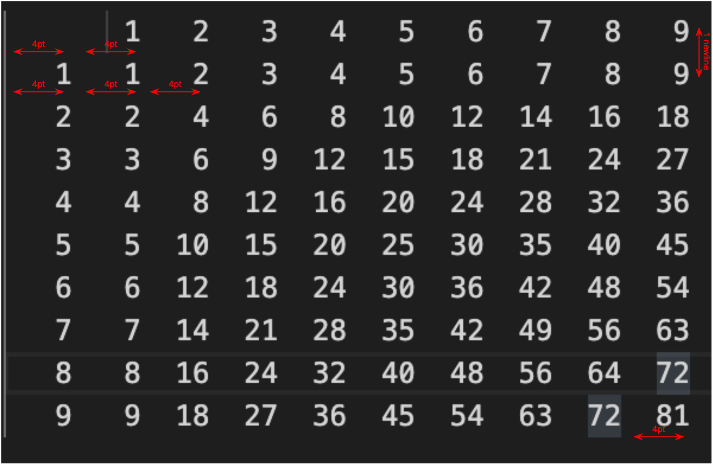
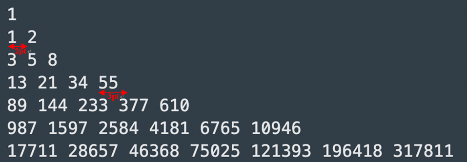

# Homework 1
**Description:**
- In this homework, we would like to test your python skill. In this course, we will use python for the programming homeworks and projects. We highly recommend you to test your python skill before enrolling this course. If you encounter diffculty in solving the problems, we encourage you to solve it by searching answers on the internet by yourself (which is a very important skill to learn) or discuss it with your friends (again a very important skill). If you have any questions, feel free to join the TAs hours listed on the course syllabus.

- You can use the test functions in the `__main__` for testing the functions you wrote. It will tell you whether you pass or you fail on some test data. You can check the test data in `/test_data/` for debugging your code. We will grade your code base on the same test data.

**Submission format**
- Rename your `hw1.py` file to `hw1_YourID.py`, for example, `hw1_r10521608.py`. Then right click this python file to zip it. (Zip only the `hw1_r10521608.py` file! Don't zip the folder). Name the zip file `hw1_YourID.zip`, for example `hw1_r10521608.zip`. After zipping the file, you can submit the zip file on NTU Cool.

- All file name should be in **lower case** and **only zip file** (no .rar and .7z). **Incompatible format will not be graded!**

**Deadline**
- 23:00, Wednesday, September 21, 2022 for students who have already enrolled.
- 23:00, Wednesday, October 5, 2022 for students in the waiting list.

<br>

---


## Problem 1
This is a pre-class test for understanding your knowledge about machine learning. This will not be graded, so it's ok if you don't know the correct answer and you don't need to search for answer either.
Link: https://docs.google.com/forms/d/e/1FAIpQLSdweoBCaqFSHf98v527X5fOaoqrFLUq9XJBxeONid8tYdr3ag/viewform

---

## Problem 2
### Description (20 points)
Write a function which receives four arguments: starting_row, ending_row,  starting_column and ending_column. For first row of the table, the integer starts from starting_row to ending_row increasingly. For first column of the table, the integer starts from starting_column to ending_column increasingly. For other entries in the table, it should be the multiplication of their corresponding row value and column value. 

### Input
Each input contains four integers representing starting_row, ending_row, starting_column and ending_column, respectively. 

### Output
Save the table content (including the numbers and the spacing formats) in a string, then return the string in the end of the function. Please check test data for more format details.

### Sample Input 
```python
problem_2(1, 9, 1, 9)
```

### Sample Output


---

## Problem 3 (20 points)
### Description 
Write a function which receives an integer as input. The integer is the height of a triangular pattern consisting of Fibonacci numbers and displays it as shown in the following sample runs. Fibonacci numbers have the following recursive definition:
$$ F_0=0, \; F_1=1 $$
$$ F_n=F_{n-2}+F_{n-1}, \; for \; n>1 $$

### Input
Each input contains an integer.

### Output
Save the triangle content (including the numbers and the spacing formats) in a string, then return the string in the end of the function. The numbers in the triangular pattern should follow Fibonacci series. Each number should be separated with a space. Note that there is a space at the end of each line. 

### Sample Input 
```python
7
```

### Sample Output



---

## Problem 4 (20 points)
### Description 
In this problem, you will create a Circle class that stores the radius of the object. You should define two functions in the Circle class to calculate the area and the perimeter.

### Input
Each input contains an integer representing the radius.

### Output
Please return the string like shown in sample output.

### Sample Input 
```python
1
```
### Sample Output
<pre>
The circle with radius 1.00 has area 3.14 and perimeter 6.28
</pre>

---

## Problem 5 (20 points)
### Description 
In this problem, you are to define a function to  determine what a given string is: an integer, decimal, or neither. 

### Input
The input is a string.

### Output
The result is one of the following 5:<br>
    1. a positive integer<br>
    2. a negative integer<br>
    3. a positive decimal<br>
    4. a negative decimal<br>
    5. not integer nor decimal<br>
Please return a string like the following sample output.<br>

### Sample Input 
123

### Sample Output
123 is a positive integer<br>

### More Inputs and Outputs
-12.3<br>
-12.3 is a negative decimal<br><br>
3.14<br>
3.14 is a positive decimal<br><br>
40000<br>
40000 is a positive integer<br><br>
123b<br>
123b is not integer nor decimal<br><br>
abcd<br>
abcd is not integer nor decimal<br><br>
0<br>
0 is a positive integer<br><br>
-abc<br>
-abc is not integer nor decimal <br>

### Hints
You may use isdigit().

---


## Problem 6 (20 points)
### Description 
Use NumPy to solve the following problems.

### Problem 6-1 (5 points)
Define the matrices below using numpy.diag() and return A, B, C.

$$
    A=\begin{bmatrix} 7 & 0 & 0 \\ 0 & 1 & 0 \\ 0 & 0 & -1 \end{bmatrix}
    , \;
    B=\begin{bmatrix} 2 & 0 & 0 & 0 \\ 0 & 2 & 0 & 0 \\ 0 & 0 & 2 & 0 \\ 0 & 0 & 0 & 2 \end{bmatrix}
    , \; 
    C=\begin{bmatrix} 1 & 0 & 0 & 0 \\ 0 & 2 & 0 & 0 \\ 0 & 0 & 3 & 0 \\ 0 & 0 & 0 & 4 \end{bmatrix}
$$


### Problem 6-2 (5 points)
Obtain the inverse, transpose and determinant of the following matrix and return the inverse, transpose, determinant.

$$
    A=\begin{bmatrix} 4 & -1 & 2 & -2 \\ 3 & -1 & 0 & 0 \\ 2 & 3 & 1 & 0 \\ 0 & 7 & 1 & 1 \end{bmatrix}
$$


### Problem 6-3 (10 points)
Use Numpy to solve the linear algebra equations listed below and return x, y, z.

$$ 
    \begin{cases}
    3x + 2y = 2     \\
    x - y = 4       \\
    5y + z = -1
    \end{cases}
$$